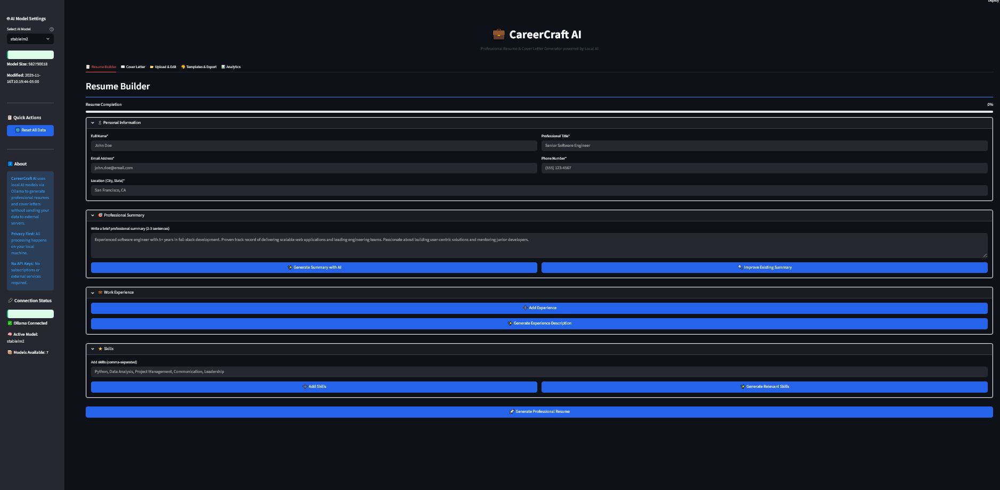
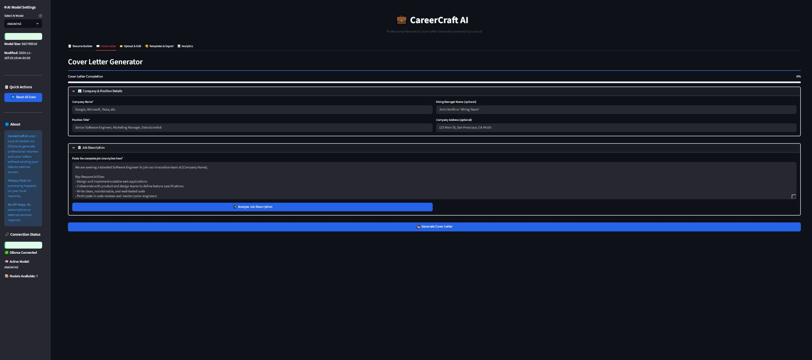
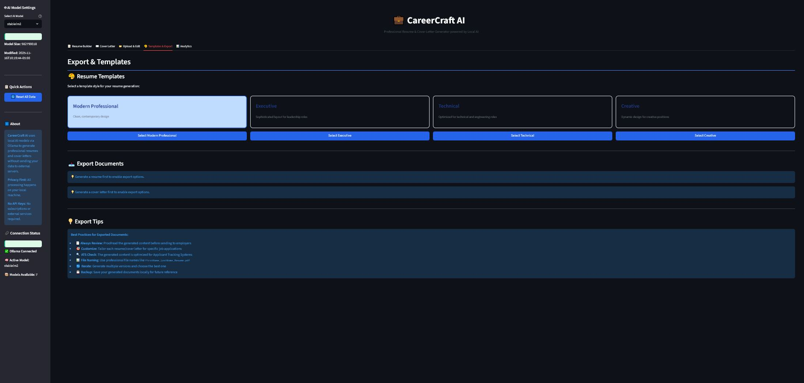
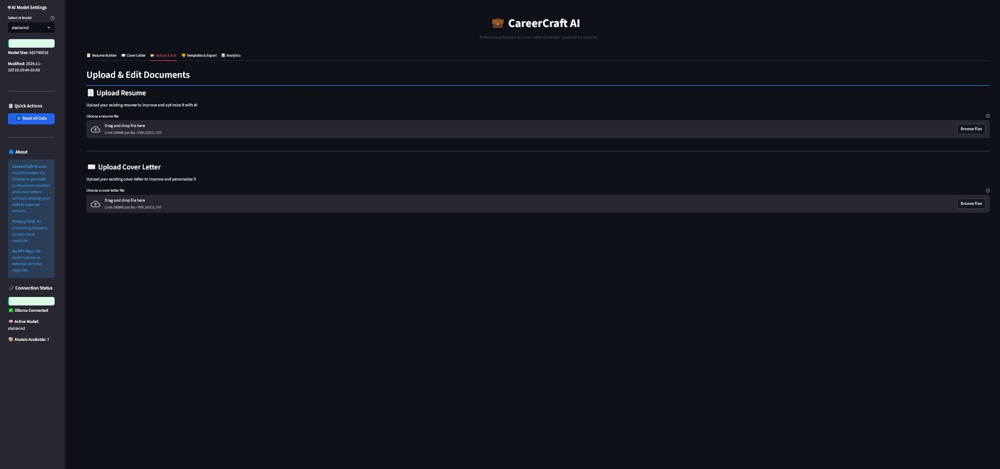

# AICoverLetterResume - Resume & Cover Letter Generator






AICoverLetterResume is a powerful, locally-hosted application that leverages advanced AI models to help you create professional, ATS-optimized resumes and cover letters. With support for uploading existing documents, multiple templates, and comprehensive analytics, AICoverLetterResume streamlines your job application process.

## Features

- **AI-Powered Content Generation**: Create professional resumes and cover letters using local AI models via Ollama
- **Document Upload & Enhancement**: Upload existing resumes and cover letters to improve and optimize them
- **Multiple Template Styles**: Choose from modern, executive, technical, and creative templates
- **ATS Optimization**: Built-in tools to optimize your documents for Applicant Tracking Systems
- **Job Description Analysis**: Extract key skills and requirements from job postings
- **Skill Matching**: Compare your skills with job requirements and get suggestions
- **Document History**: Save and retrieve previous documents for quick access
- **Export Options**: Download your documents as professionally formatted PDFs
- **Analytics Dashboard**: Get insights on word count, structure, and optimization scores

## Installation

### Prerequisites

1. Install Python 3.8 or higher
2. Install Ollama from [https://ollama.com/download](https://ollama.com/download)
3. Start Ollama server: `ollama serve`
4. Download a model: `ollama pull model name`

### Application Setup

1. Clone this repository:
   ```bash
   git clone https://github.com/yourusername/AICoverLetterResume.git
   cd AICoverLetterResume
   ```

2. Install the required packages:
   ```bash
   pip install -r requirements.txt
   ```

3. Run the application:
   ```bash
   streamlit run main.py
   ```

## Usage

### Creating a New Resume

1. Fill in your personal information in the "Resume Builder" tab
2. Add your work experience, education, and skills
3. Use the AI-powered tools to enhance your content
4. Generate your resume with one click
5. Export as a PDF or save to history

### Creating a New Cover Letter

1. Enter company and position details in the "Cover Letter Generator" tab
2. Paste the job description
3. Use the job analysis feature to extract key requirements
4. Generate a personalized cover letter
5. Further personalize and optimize as needed

### Uploading Existing Documents

1. Go to the "Upload & Edit" tab
2. Upload your existing resume or cover letter (PDF, DOCX, or TXT)
3. Review the parsed information
4. Use AI to improve and optimize your document
5. Compare the before and after versions

### Customizing Templates

1. Select from four template styles in the "Templates & Export" tab
2. Choose between Modern Professional, Executive, Technical, or Creative
3. Generate documents with your preferred template
4. Export as PDF with professional formatting


## Troubleshooting

### Ollama Connection Issues

- Ensure Ollama is running: `ollama serve`
- Check that no other application is using port 11434
- Restart Ollama if it's been running for a long time
- Try `localhost:11434` in your browser to verify the server is running

### Model Issues

- If you get "model not found" errors, download the model first
- Use `ollama list` to see available models
- Try `ollama pull llama3:latest` for the most recent version
- Large models (7B+ parameters) require 8GB+ RAM


